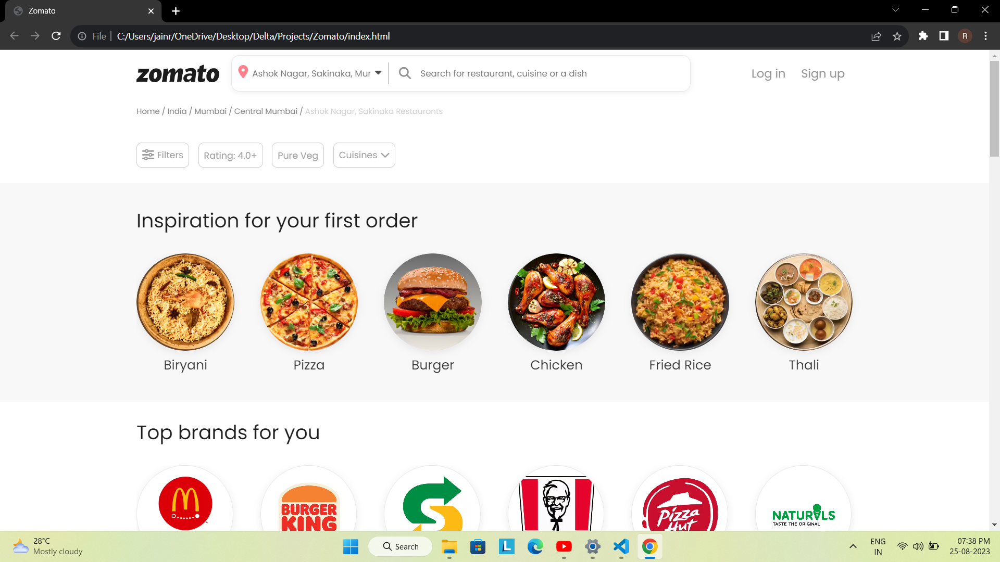

# Zomato Clone

Welcome to the Zomato Clone project! This project replicates the look and feel of the popular food delivery app, Zomato. It icludes navigation bar, a FAQ section and footer which resemblems with the actual website.

## Features

- **Restaurant Listings:** Browse through a variety of restaurants available in the clone.
- **Nagivation:** A sticky navigation similar to zomato.
- **Visual Appeal:** The clone emulates the visual aesthetics of the Zomato website.

## Getting Started

To get started with the Zomato Clone project:

1. Clone the repository: `git clone [repository_url]`
2. Open the `index.html` file in your preferred web browser.

## App Preview

## Technologies Used

- HTML
- CSS

## Acknowledgments

This project is inspired by the Zomato food delivery website.

